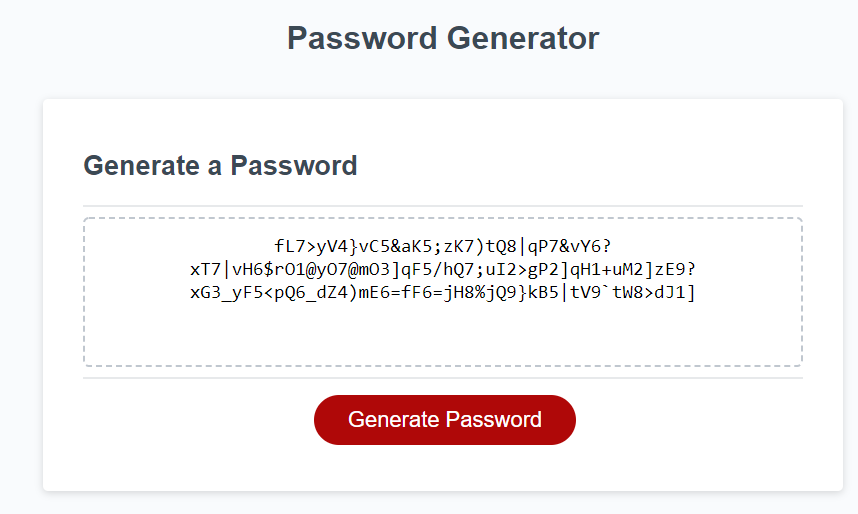
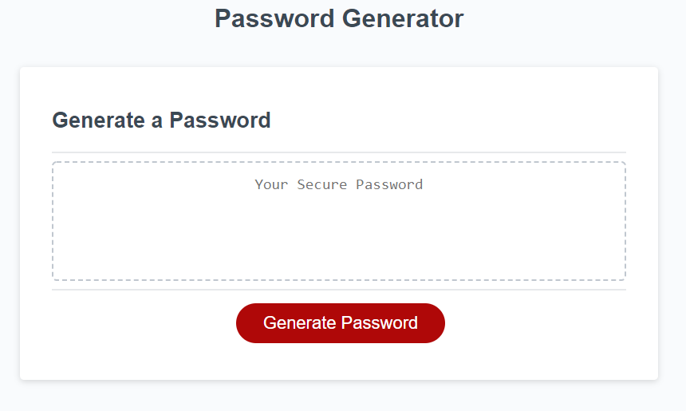
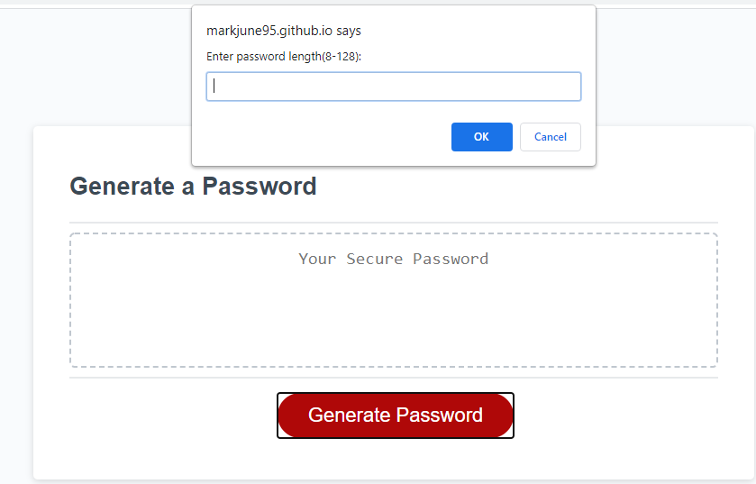
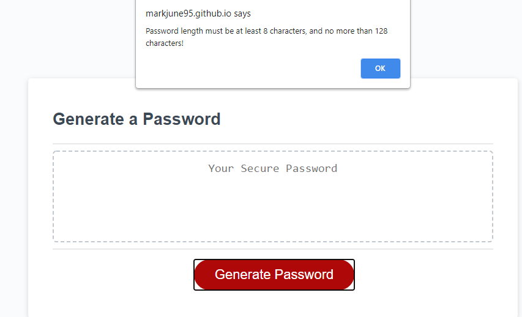
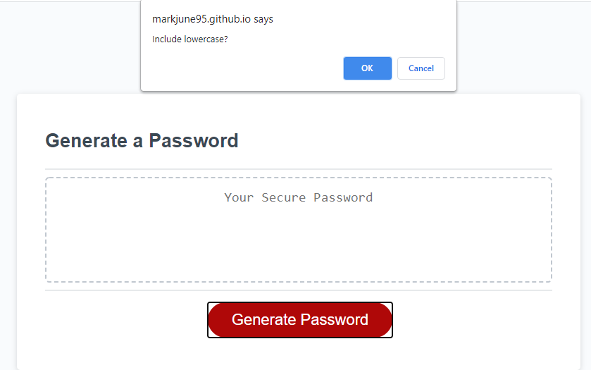
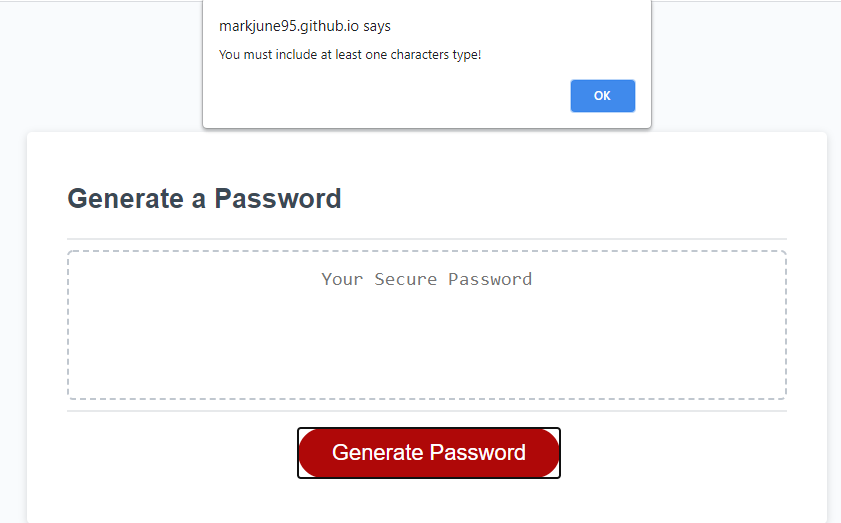

### This password-generator web application will allow user to generate a complex password, just like the following image.

### This is the initial screen the password generator.

### When user click the Generate Password button, the user will be prompted to enter the length of password; minimum 8 characters and maximum 128 characters.

### If user enter the password length less than 8 characters or more than 128 characters, input validation will be triggered and alert message will be displayed.

### Then, user will be prompted to include character types in the password such as lowercase, uppercase, numbers, and special characters.

### Again, if user do not include any character types, input validation will be triggered and alert message will be display.

### Finally, if user inputs are valid, a password will be generated according to the user preference.
